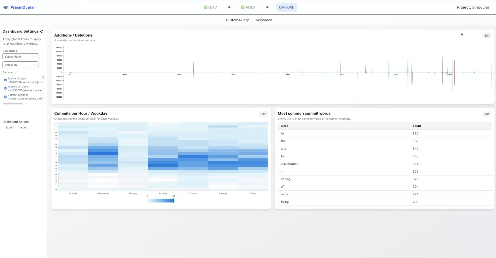

# WasmOcular

**Master Thesis: Creating an Ubiquitous Platform for Mining and Visualizing Software Repositories Using WebAssembly in the Browser**

## Overview

WasmOcular is a browser-based platform that enables client-side mining and visualization of Git repositories. By leveraging WebAssembly (WASM), the application performs all data processing locally without requiring server-side computation, making repository analysis ubiquitous and accessible.

<p align="center">
  
</p>

The platform allows users to:

- Load and index local Git repositories or via .git URL
- Fetch the GitHub API for issues and events (to correlate commits)
- Execute custom SQL queries on repository data using DuckDB
- Create customizable dashboards with various visualizations (StackedAreaChart, HeatMap, Text Table)

All data is stored locally in the browser using the OPFS (Origin Private File System) and IndexedDB. Dashboard and project configurations are saved to localStorage. It is fully offline-capable as a Progressive Web App (PWA).

You can try it out here (use Chromium browser): [https://christoph-det.github.io/wasmocular](https://christoph-det.github.io/wasmocular)

<p align="center">
  
</p>

The WasmOcular logo was created using Google Gemini / Nano Banana Pro.

## Technology Stack

| Category             | Technologies                                            |
| -------------------- | ------------------------------------------------------- |
| **Frontend**         | React, TypeScript, Vite                                 |
| **State Management** | MobX                                                    |
| **Database**         | DuckDB                                                  |
| **Git Processing**   | Gitoxide (local processing) and wasm-git (remote clone) |
| **Visualization**    | D3.js, ECharts                                          |

---

## Installation

### Prerequisites

- for building the wasm module: Rust, Cargo
- all features are only working in Chromium browsers (e.g. the File System Access API is not available in other browsers at the moment).

### Setup

After cloning the repository, install dependencies:

```bash
pnpm install
```

Optional: If you made changes to the Rust Code, build the WASM module:

If you haven't installed Emscripten follow the guide here: [Emscripten Installation](https://emscripten.org/docs/getting_started/downloads.html#installation-instructions-using-the-emsdk-recommended)

If you have it installed already, change the location of the emsdk folder in `.cargo/config.toml`

Then you can build it with, the files are getting copied to the right location automatically:

```bash
pnpm run build:wasmgix
```

---

## Usage

### Development

Start the local development server with hot reload:

```bash
pnpm run dev
```

### Production Build

Build the application for production deployment:

```bash
pnpm run build
```

The static files are generated in the `dist` folder, ready for deployment to any static hosting.

## Project Structure

```
src/
|-- components/      # React UI components
  |-- ui/            # ShadCN components
  |-- vizualization/ # charts for Dashboard
|-- hooks/           # Custom React hooks
|-- lib/             # Utility libraries, converters, errors
|-- pages/           # Application pages
|-- store/           # MobX state management stores
|-- workers/         # Web Workers for async processing of Git and Database
|-- App.tsx          # Main app with routing
|-- main.tsx         # Entry point
```

## Third-Party Libraries

This project uses the following notable open-source libraries:

- [wasm-git](https://github.com/petersalomonsen/wasm-git) - libgit2 compiled to WebAssembly (GPLv2 with linking exception)
- [gitoxide](https://github.com/GitoxideLabs/gitoxide) - Pure Rust Git implementation (MIT/Apache-2.0)
- [DuckDB WASM](https://github.com/duckdb/duckdb-wasm) - In-browser analytical database (MIT)
- [Apache Arrow](https://arrow.apache.org/) - Columnar data format (Apache-2.0)

## Citation

```latex
@mastersthesis{dethloff2026wasmocular,
  title     = "Creating an Ubiquitous Platform for Mining and Visualizing Software Repositories Using WebAssembly in the Browser",
  author    = "Christoph Dethloff",
  date      = "",
  school    = "Vienna University of Technology, Austria",
  url       = ""
}
```
